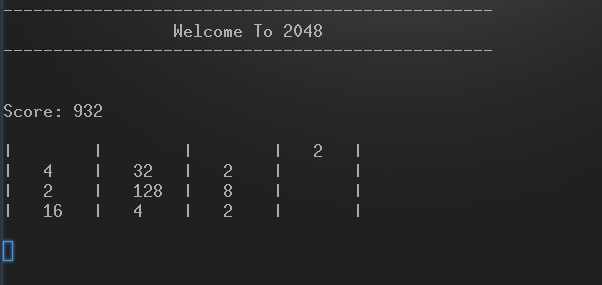
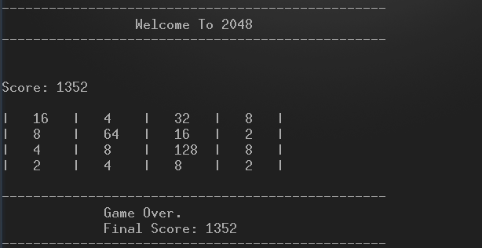

# 2048 Game
This program is the popular puzzle game [2048](https://play2048.co/). Currently the game board is shown using text-based grpahics (ASCII).

There is also design specification that can be found in the *Specification* folder.

## Usage

To run the code, go to the directory containing the **Makefile** and type the following in a CLI:

``` 
make expt 
```
If you want to run the automated test cases, use the following:

```
make test
```
Here's a snapshot of the game:



Game over!



